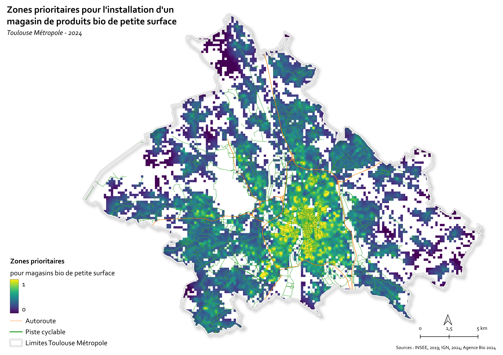

# UE901_32 – Spatial Modelling

**Multi-Criteria Evaluation (MCE) for identifying optimal locations for new organic stores in Toulouse Métropole**  
📍 SIGMA Master – UE901_32 “Modélisation spatio-temporelle”

---

## 🌍 Project Context

This project was carried out within the **UE901_32 “Modélisation spatio-temporelle”** module of the SIGMA Master’s program (Agro Toulouse / Université Toulouse II – Jean Jaurès).  

The objective was to create a **potentiality map** to identify the most suitable locations for a new **organic food store** in the Toulouse metropolitan area, using a **Multi-Criteria Evaluation (MCE)** approach.  

By combining **socio-economic factors**, **land use constraints**, and **accessibility indicators**, we modelled spatial interactions to highlight priority areas for two different retail scenarios:
- 🏙 **Urban small-scale store**, focused on soft mobility and city center accessibility;  
- 🏬 **Suburban large-scale store**, emphasizing car access and logistical connectivity.

---

## 🧭 Methodological Workflow

The workflow integrates **Python** for data processing and **QGIS** for spatial analysis and visualization. It includes:

1. **Defining constraints & factors**  
   - Limiting the study to the 37 municipalities of Toulouse Métropole.  
   - Excluding water bodies from analysis.  
   - Selecting socio-economic variables (income, education, age, socio-professional categories) from **INSEE** and **Agence Bio** datasets.

2. **Data preprocessing**  
   - Harmonizing spatial resolutions between IRIS and Filosofi grids.  
   - Estimating population characteristics at the grid-cell level through intersection and proportional allocation.  
   - Rasterizing constraints and normalizing factors to a [0,1] scale.

3. **Weighting socio-economic factors**  
   - Calculating standard deviations of consumption rates to derive relative weights.  
   - Combining weighted factors into a single composite layer representing potential organic consumers.

4. **Accessibility modelling**  
   - Generating distance rasters (bike paths and major roads) with Python.  
   - Integrating accessibility factors (⅔ socio-economic + ⅓ accessibility) depending on the scenario.

5. **MCE aggregation and mapping**  
   - Producing final suitability maps for both scenarios using raster algebra and weighted overlay techniques.

<p align="center">
  
</p>

---

## 🧰 Data Sources

| Data Type                     | Source                          | Year |
|-------------------------------|----------------------------------|------|
| Socio-economic (income, age…) | INSEE Filosofi & IRIS           | 2019–2020 |
| Consumption habits            | Agence Bio / L'ObSoCo          | 2023 |
| Administrative boundaries     | IGN BDTOPO                     | 2024 |
| Bike paths                    | Géovélo                        | 2024 |
| Organic stores                | OSM (Overpass Turbo)           | 2024 |

---

## 🛠 Technologies & Tools

- **Python** – data processing (GeoPandas, Rasterio, Numpy, Matplotlib, Fiona, OS)  
- **QGIS** – spatial analysis, raster operations, and map layout  
- **Multi-Criteria Evaluation (MCE)** – constraint/factor weighting and raster overlay  
- **OpenStreetMap + Overpass Turbo** – extracting store locations and infrastructure data  

---

## 📈 Key Outputs

- Normalized raster layers for socio-economic and accessibility factors  
- Weighted composite potential maps for two scenarios (urban vs suburban)  
- Comparative analysis of existing organic stores vs modelled potential areas  
- Identification of promising sites such as **Portet-sur-Garonne** for new store implantation

<p align="center">
  
</p>

---

## 📂 Repository Structure

```

901_32_ModelisationSpt/
├── data/                # Raw and processed INSEE, OSM, IGN datasets
├── scripts/             # Python scripts for data processing and distance rasters
├── outputs/             # Final raster maps and intermediate layers
├── images/              # Figures used in the report and README
├── rapport/             # PDF report and supplementary materials
└── README.md

```

---

## ⚖️ License

This repository was created for academic and demonstration purposes.  
Feel free to reuse or adapt with appropriate attribution.

---